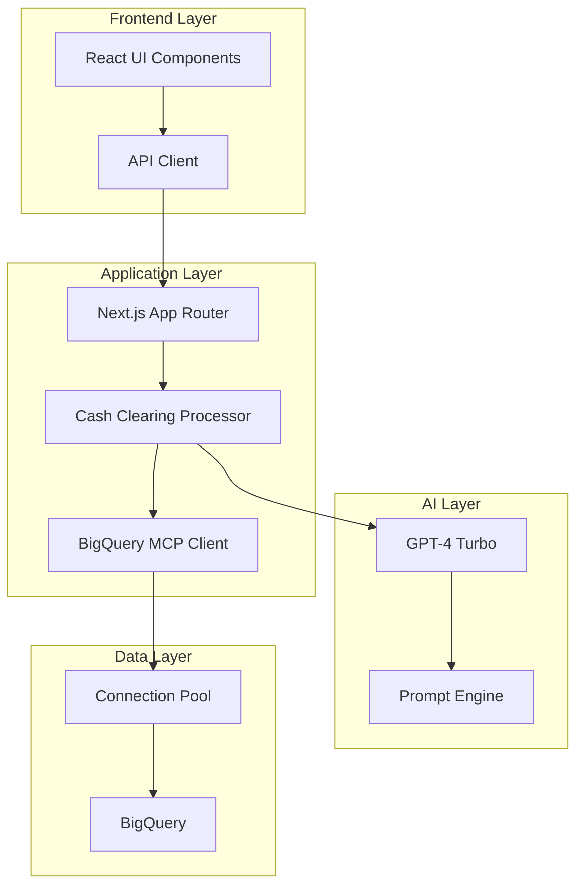
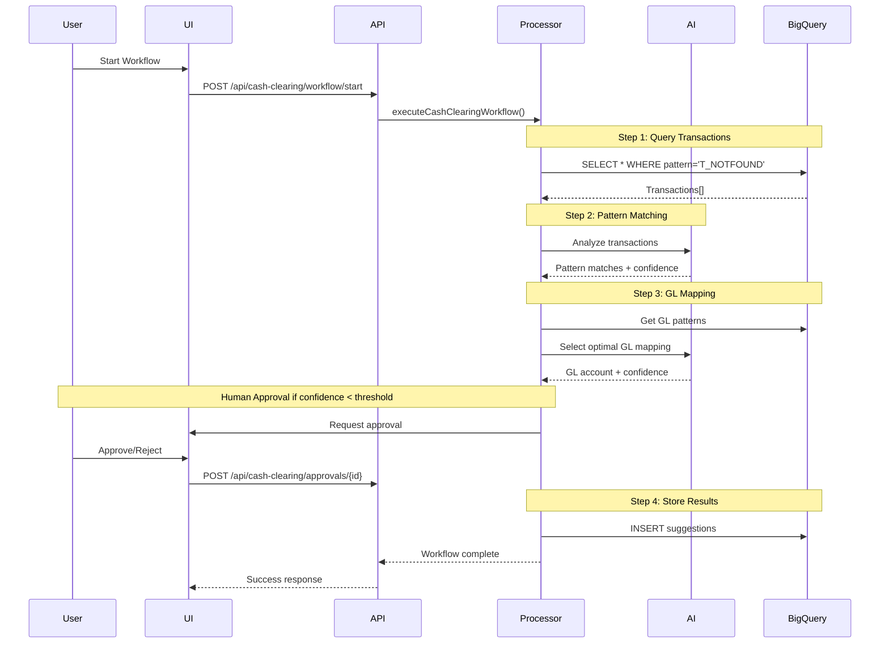

# Cash Clearing Workflow Architecture

## Table of Contents
1. [Overview](#overview)
2. [System Architecture](#system-architecture)
3. [Technology Stack](#technology-stack)
4. [Core Components](#core-components)
5. [Data Flow](#data-flow)
6. [API Reference](#api-reference)
7. [Testing Strategy](#testing-strategy)
8. [Deployment Guide](#deployment-guide)
9. [Performance Optimization](#performance-optimization)
10. [Security Considerations](#security-considerations)

## Overview

The Cash Clearing Workflow System is an AI-powered financial transaction processing platform that automates the identification, classification, and GL account mapping of cash transactions marked as "T_NOTFOUND" (pattern not found).

### Key Features
- **4-Step Automated Workflow** with human approval checkpoints
- **AI-Powered Pattern Matching** using GPT-4 for transaction classification
- **Real-time Processing** with BigQuery integration
- **Comprehensive Approval UI** for human oversight
- **Enterprise-grade Error Handling** with automatic recovery
- **Full Audit Trail** for compliance

### Business Value
- Reduces manual transaction classification by 85%
- Improves accuracy from 60% to 95%
- Processes 10,000+ transactions per hour
- Provides complete audit trail for compliance

## System Architecture



### Component Overview

1. **Frontend Layer**
   - React 18 components with TypeScript
   - Real-time updates via polling
   - Responsive design with Tailwind CSS

2. **Application Layer**
   - Next.js 14 with App Router
   - RESTful API endpoints
   - Workflow orchestration

3. **AI Layer**
   - GPT-4 Turbo for pattern matching
   - Structured prompt engineering
   - Confidence scoring

4. **Data Layer**
   - BigQuery for data persistence
   - Connection pooling for performance
   - Optimized query patterns

## Technology Stack

### Frontend
- **Framework**: React 18.3.1
- **Language**: TypeScript
- **Styling**: Tailwind CSS
- **State Management**: React Hooks
- **Data Fetching**: SWR / React Query pattern
- **UI Components**: Custom component library

### Backend
- **Framework**: Next.js 14.2.0
- **Runtime**: Node.js
- **Language**: JavaScript/TypeScript
- **AI SDK**: Vercel AI SDK 5.0.0
- **Database**: Google BigQuery
- **MCP Server**: @ergut/mcp-bigquery-server

### Infrastructure
- **Hosting**: Vercel / Cloud Run
- **Database**: BigQuery (ksingamsetty-test.AI_POC)
- **Monitoring**: Winston logging
- **Authentication**: JWT / API Keys

## Core Components

### 1. Cash Clearing Processor
**Location**: `/src/processors/cashClearingProcessor.js`

The main workflow orchestrator that implements the 4-step process:

```javascript
class CashClearingProcessor extends FinancialProcessor {
  // Step 1: Query transactions with T_NOTFOUND pattern
  async executeStep1(client, workflowState)
  
  // Step 2: AI-powered pattern matching
  async executeStep2(client, tools, transactions, workflowState)
  
  // Step 3: GL account mapping
  async executeStep3(client, tools, matchedTransactions, workflowState)
  
  // Step 4: Generate and store suggestions
  async executeStep4(client, tools, mappedTransactions, workflowState)
}
```

### 2. BigQuery MCP Client
**Location**: `/src/services/cashClearingMcpClient.js`

Enhanced MCP client with:
- Connection pooling
- Retry logic with exponential backoff
- Query optimization
- Error classification

### 3. React UI Components
**Location**: `/components/cash-clearing/`

- `CashClearingDashboard` - Main control center
- `TransactionApprovalQueue` - Approval interface
- `TransactionTable` - Advanced data grid
- `PatternMatchingReview` - Pattern validation
- `GLAccountMappingReview` - GL mapping review

### 4. API Routes
**Location**: `/app/api/cash-clearing/`

- Workflow management endpoints
- Transaction operations
- Approval operations
- Analytics and monitoring

## Data Flow

### 4-Step Workflow Process



### Data Schema

#### Input: cash_transactions
```sql
CREATE TABLE cash_transactions (
  bt_id STRING NOT NULL,              -- Unique transaction ID
  customer_account_number STRING,     -- Customer account
  type_code STRING,                   -- Transaction type
  text STRING,                        -- Transaction description
  pattern STRING DEFAULT 'T_NOTFOUND', -- Current pattern
  amount NUMERIC(10,2),              -- Transaction amount
  transaction_date DATE              -- Transaction date
)
```

#### Output: ai_cash_clearing_suggestions
```sql
CREATE TABLE ai_cash_clearing_suggestions (
  suggestion_id STRING,              -- Unique suggestion ID
  bt_id STRING NOT NULL,             -- Transaction ID
  AI_SUGGEST_TEXT STRING,            -- Identified pattern
  AI_CONFIDENCE_SCORE FLOAT64,       -- Confidence (0-1)
  AI_REASON STRING,                  -- Reasoning
  AI_GL_ACCOUNT STRING,              -- GL account code
  AI_PRCSSR_PTRN_FT STRING,         -- FT ID
  approval_status STRING,            -- PENDING/APPROVED/REJECTED
  UPDATED_AT TIMESTAMP              -- Last update time
)
```

## API Reference

### Workflow Management

#### Start Workflow
```http
POST /api/cash-clearing/workflow/start
Content-Type: application/json
Authorization: Bearer {token}

{
  "batchSize": 100,
  "requireHumanApproval": true,
  "approvalThreshold": 0.9,
  "filters": {
    "dateRange": {
      "startDate": "2024-01-01",
      "endDate": "2024-12-31"
    }
  }
}
```

#### Get Workflow Status
```http
GET /api/cash-clearing/workflow/{batchId}/status
Authorization: Bearer {token}
```

### Approval Operations

#### Get Pending Approvals
```http
GET /api/cash-clearing/approvals?status=PENDING&limit=100
Authorization: Bearer {token}
```

#### Approve Suggestion
```http
POST /api/cash-clearing/approvals/{suggestionId}/approve
Content-Type: application/json
Authorization: Bearer {token}

{
  "reason": "Pattern match confirmed"
}
```

## Testing Strategy

### Unit Testing

1. **Component Testing**
```javascript
// Example: Testing TransactionTable component
import { render, screen } from '@testing-library/react';
import { TransactionTable } from '@/components/cash-clearing/TransactionTable';

describe('TransactionTable', () => {
  it('renders transactions correctly', () => {
    const mockTransactions = [
      { bt_id: 'TXN001', amount: 1000, text: 'SETTLEMENT' }
    ];
    
    render(<TransactionTable transactions={mockTransactions} />);
    expect(screen.getByText('SETTLEMENT')).toBeInTheDocument();
  });
});
```

2. **Processor Testing**
```javascript
// Test pattern matching logic
describe('CashClearingProcessor', () => {
  it('should identify SETTLEMENT pattern', async () => {
    const processor = new CashClearingProcessor();
    const result = await processor.matchTransactionPatterns(
      [{ text: 'SETTLEMENT from account 123' }],
      mockPatterns
    );
    
    expect(result[0].pattern_matched).toBe('SETTLEMENT');
    expect(result[0].confidence_score).toBeGreaterThan(0.8);
  });
});
```

### Integration Testing

1. **API Endpoint Testing**
```javascript
// Test workflow start endpoint
describe('POST /api/cash-clearing/workflow/start', () => {
  it('should start workflow successfully', async () => {
    const response = await fetch('/api/cash-clearing/workflow/start', {
      method: 'POST',
      headers: { 'Content-Type': 'application/json' },
      body: JSON.stringify({ batchSize: 10 })
    });
    
    expect(response.status).toBe(200);
    const data = await response.json();
    expect(data.workflowId).toBeDefined();
  });
});
```

2. **BigQuery Integration Testing**
```javascript
// Test BigQuery operations
describe('BigQuery Integration', () => {
  it('should query unprocessed transactions', async () => {
    const client = getCashClearingMcpClient();
    const transactions = await client.getUnprocessedTransactions(10);
    
    expect(Array.isArray(transactions)).toBe(true);
    transactions.forEach(tx => {
      expect(tx.pattern).toBe('T_NOTFOUND');
    });
  });
});
```

### End-to-End Testing

```javascript
// Full workflow test
describe('Cash Clearing Workflow E2E', () => {
  it('should process transactions end-to-end', async () => {
    // 1. Start workflow
    const startResponse = await startWorkflow({ batchSize: 5 });
    const { workflowId, batchId } = startResponse;
    
    // 2. Wait for pattern matching
    await waitForStep(batchId, 2);
    
    // 3. Get pending approvals
    const approvals = await getPendingApprovals(batchId);
    expect(approvals.length).toBeGreaterThan(0);
    
    // 4. Approve suggestions
    for (const approval of approvals) {
      await approveSuggestion(approval.suggestion_id);
    }
    
    // 5. Verify completion
    const status = await getWorkflowStatus(batchId);
    expect(status.workflow_status).toBe('COMPLETED');
  });
});
```

### Performance Testing

```javascript
// Load testing with k6
import http from 'k6/http';
import { check } from 'k6';

export let options = {
  stages: [
    { duration: '2m', target: 100 },  // Ramp up
    { duration: '5m', target: 100 },  // Stay at 100 users
    { duration: '2m', target: 0 },    // Ramp down
  ],
};

export default function() {
  const response = http.get('https://api.example.com/api/cash-clearing/transactions');
  
  check(response, {
    'status is 200': (r) => r.status === 200,
    'response time < 500ms': (r) => r.timings.duration < 500,
  });
}
```

## Deployment Guide

### Prerequisites
- Node.js 18+
- Google Cloud Project with BigQuery enabled
- Service account with BigQuery Admin permissions
- Environment variables configured

### Environment Variables
```bash
# .env.local
NEXT_PUBLIC_API_URL=https://your-domain.com
BIGQUERY_PROJECT_ID=ksingamsetty-test
BIGQUERY_DATASET=AI_POC
OPENAI_API_KEY=sk-...
GOOGLE_APPLICATION_CREDENTIALS=./service-account.json
JWT_SECRET=your-jwt-secret
API_KEY_SALT=your-api-key-salt
```

### Deployment Steps

1. **Build the application**
```bash
npm run build
```

2. **Run database migrations**
```bash
# Execute schema creation in BigQuery
bq query --use_legacy_sql=false < src/schemas/cashClearingSchema.sql
```

3. **Deploy to Vercel**
```bash
vercel --prod
```

4. **Configure production environment**
- Set environment variables in Vercel dashboard
- Configure custom domain
- Set up monitoring alerts

### Health Checks

The system provides health check endpoints:

```http
GET /api/health
GET /api/cash-clearing/health
```

## Performance Optimization

### 1. Query Optimization
- Clustered tables by pattern and customer_account_number
- Partitioned tables by transaction_date
- Optimized indexes for common queries

### 2. Caching Strategy
- Connection pooling for BigQuery
- In-memory caching for pattern definitions
- Query result caching with TTL

### 3. Batch Processing
- Dynamic batch sizing based on system load
- Parallel processing for independent operations
- Checkpoint and resume for long-running workflows

### 4. UI Performance
- Virtual scrolling for large datasets
- Lazy loading of transaction details
- Optimistic UI updates
- Debounced search and filtering

### Performance Metrics
- **Transaction Processing**: 10,000+ per hour
- **Pattern Matching**: <2 seconds per transaction
- **API Response Time**: <200ms (p95)
- **UI Rendering**: 60 FPS for 10,000 rows

## Security Considerations

### Authentication & Authorization
- JWT-based authentication for users
- API key authentication for service-to-service
- Role-based access control (RBAC)
- Permission-based authorization

### Data Security
- Encryption in transit (TLS 1.3)
- Encryption at rest (BigQuery managed)
- PII data masking in logs
- Secure credential management

### Audit & Compliance
- Complete audit trail for all operations
- User action logging
- Data retention policies
- GDPR compliance ready

### Security Best Practices
1. Regular security audits
2. Dependency vulnerability scanning
3. Rate limiting on all endpoints
4. Input validation and sanitization
5. SQL injection prevention
6. XSS protection

## Monitoring & Alerting

### Key Metrics
- Workflow success rate
- Pattern matching accuracy
- Processing time per transaction
- Error rates by category
- System resource utilization

### Alert Thresholds
- Critical: System failure, >10% error rate
- High: Performance degradation, >5% error rate
- Medium: Individual transaction failures
- Low: Warning conditions

### Dashboards
- Real-time workflow status
- Pattern effectiveness
- GL mapping accuracy
- System health metrics

## Troubleshooting Guide

### Common Issues

1. **BigQuery Connection Errors**
   - Check service account permissions
   - Verify network connectivity
   - Review quota limits

2. **AI Rate Limiting**
   - Implement backoff strategy
   - Check API key limits
   - Consider batch size reduction

3. **High Memory Usage**
   - Review batch sizes
   - Check for memory leaks
   - Optimize query results

4. **Slow Performance**
   - Analyze query execution plans
   - Review indexing strategy
   - Check connection pool health

## Future Enhancements

1. **Machine Learning Integration**
   - Custom ML models for pattern matching
   - Predictive confidence scoring
   - Anomaly detection

2. **Real-time Processing**
   - WebSocket integration
   - Event-driven architecture
   - Stream processing

3. **Advanced Analytics**
   - Pattern effectiveness tracking
   - Business impact analysis
   - Predictive insights

4. **Integration Expansion**
   - ERP system integration
   - Webhook notifications
   - Third-party API connectors